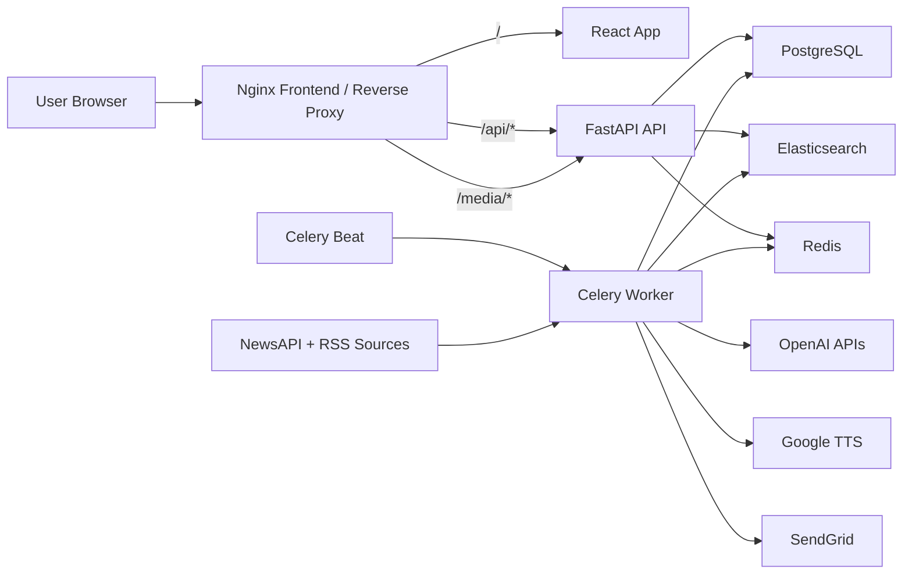

# BriefBiz

BriefBiz is an AI-powered business and startup news platform inspired by short-form news apps, rebuilt for global business, venture, startup, and market-moving stories.

## Stack

- Backend: FastAPI, SQLAlchemy async ORM, PostgreSQL
- Workers: Celery, Redis
- Search: Elasticsearch
- Frontend: React, TypeScript, Vite, Tailwind CSS, Framer Motion
- AI: OpenAI GPT-4o-mini, `text-embedding-3-small`
- Audio: Google Cloud Text-to-Speech
- Email: SendGrid
- Deployment: Docker, Docker Compose, Nginx, Google Cloud Run, Cloud Build

## What Is Implemented

- Phase 1: monorepo scaffold, backend/frontend bootstrapping, Docker Compose foundations
- Phase 2: SQLAlchemy models plus Alembic migrations
- Phase 3: News ingestion pipeline for NewsAPI and curated RSS feeds
- Phase 4: summarization and enrichment workers with search indexing and TTS
- Phase 5: REST API endpoints for auth, feed, articles, companies, search, and notifications
- Phase 6: core frontend UI including swipe cards, search, profile, bookmarks, funding radar, and company pages
- Phase 7: shareable story cards, disagreement detection, weekly digest plumbing, and company-follow notifications
- Phase 8: production packaging with Dockerfiles, Nginx reverse proxy, Cloud Build config, and deployment docs

## Repository Layout

```text
BriefBiz/
|- backend/
|  |- app/
|  |- alembic/
|  `- Dockerfile
|- frontend/
|  |- src/
|  |- nginx/
|  `- Dockerfile
|- cloudbuild.yaml
|- docker-compose.yml
`- README.md
```

## Local Development

### Prerequisites

- Python 3.11+
- Node.js 22+
- Docker Desktop

### Environment Variables

Create `backend/.env` from `backend/.env.example`.

Required backend variables:

- `DATABASE_URL`
- `REDIS_URL`
- `ELASTICSEARCH_URL`
- `OPENAI_API_KEY`
- `NEWS_API_KEY`
- `GOOGLE_TTS_KEY`
- `JWT_SECRET`

Optional but used by later phases:

- `SENDGRID_API_KEY`
- `SENDGRID_FROM_EMAIL`
- `APP_BASE_URL`
- `CELERY_BROKER_URL`
- `CELERY_RESULT_BACKEND`

### Run With Docker Compose

```bash
docker compose up --build
```

Services started:

- `frontend` on `http://localhost`
- `api` behind Nginx at `http://localhost/api`
- `worker`
- `beat`
- `postgres`
- `redis`
- `elasticsearch`

### Run Without Docker

Backend:

```bash
cd backend
pip install -e .[dev]
alembic upgrade head
uvicorn app.main:app --reload
```

Frontend:

```bash
cd frontend
npm install
npm run dev
```

## Production Containers

### Backend Image

- File: `backend/Dockerfile`
- Runs FastAPI with `uvicorn`
- Supports Cloud Run `PORT` injection

### Frontend Image

- File: `frontend/Dockerfile`
- Multi-stage build: Vite build output served by Nginx
- Nginx template proxies:
  - `/api/*` to the backend upstream
  - `/media/*` to backend-served audio/share-card assets
  - `/*` to the React SPA

## Health Checks

- Backend: `GET /health`
- Frontend container: `GET /healthz`

## Cloud Build / Cloud Run

`cloudbuild.yaml` builds and pushes two images:

- `briefbiz-api`
- `briefbiz-web`

Then it deploys both to Cloud Run.

Important substitutions:

- `_REGION`
- `_REPOSITORY`
- `_API_SERVICE`
- `_WEB_SERVICE`
- `_API_UPSTREAM`

`_API_UPSTREAM` should point the frontend Nginx proxy to the deployed API URL.

## Architecture



## Key User Flows

- Ingestion: Celery Beat triggers fetchers every 15 minutes, stores raw articles, enriches them, and indexes them.
- Feed: frontend consumes feed/search/company/profile APIs and falls back to mock data in offline dev scenarios.
- Notifications: followed-company mentions generate notification rows during ingestion.
- Share cards: article endpoint generates branded PNG cards on demand.
- Weekly digest: Sunday 8 AM UTC job builds and sends per-user digest emails.

## Deployment Notes

- For Docker Compose, Nginx proxies to `http://api:8000`.
- For Cloud Run, set frontend `API_UPSTREAM` to the public API service URL.
- Elasticsearch is configured as single-node in Compose for local development.
- Redis is used for both Celery broker and cache defaults.

## Verification

Recommended checks:

```bash
python -m compileall backend/app backend/alembic
cd frontend && npm run build
docker compose config
```

## Next Work

- Harden auth and OAuth flows
- Add richer test coverage around workers and deployment paths
- Add generated OG previews and email previews to CI
- Add production secret management and observability
