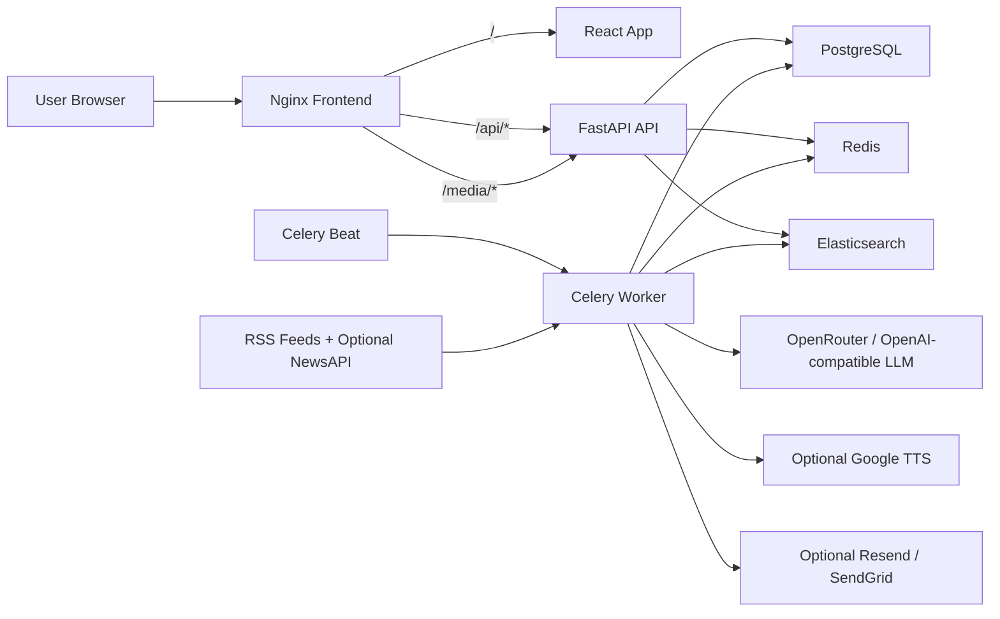

# BriefBiz

BriefBiz is an AI-powered business and startup news platform focused on global markets, startups, venture activity, funding, layoffs, regulation, and company intelligence. It combines a FastAPI backend, Celery ingestion/enrichment workers, Elasticsearch-backed search, and a React frontend optimized for short-form news consumption.

## What The Repo Contains

- `backend/`: FastAPI API, SQLAlchemy models, Alembic migrations, Celery workers, ingestion and enrichment services
- `frontend/`: React + TypeScript + Vite application, Tailwind styling, Framer Motion interactions, Nginx frontend container
- `docker-compose.yml`: local full-stack orchestration
- `cloudbuild.yaml`: Google Cloud Build / Cloud Run deployment pipeline

## Core Features

- AI-generated article summaries and deep dives
- Business/startup news ingestion from RSS and optional NewsAPI
- Article enrichment for companies, regions, verticals, sentiment, and impact
- Shareable story cards
- Search across articles and companies
- Bookmarks, notifications, and profile preferences
- Weekly digest email plumbing
- Audio playback with browser speech by default and optional Google TTS

## Stack

### Backend

- Python 3.11+
- FastAPI
- SQLAlchemy async ORM
- Alembic
- Celery
- Redis
- PostgreSQL
- Elasticsearch
- Pydantic v2

### Frontend

- React 18
- TypeScript
- Vite
- Tailwind CSS
- Framer Motion
- React Query
- React Router
- Axios

### Deployment

- Docker
- Docker Compose
- Nginx
- Google Cloud Build
- Google Cloud Run

## Repository Layout

```text
BriefBiz/
|- backend/
|  |- app/
|  |- alembic/
|  |- tests/
|  |- Dockerfile
|  |- pyproject.toml
|  `- README.md
|- frontend/
|  |- src/
|  |- nginx/
|  |- tests/
|  |- Dockerfile
|  `- README.md
|- .github/
|- docker-compose.yml
|- cloudbuild.yaml
|- .env.example
`- README.md
```

## Environment Setup

Create `backend/.env` from [backend/.env.example](C:\Users\prana\OneDrive\Documents\Playground\BriefBiz\backend\.env.example).

### Required

- `DATABASE_URL`
- `REDIS_URL`
- `ELASTICSEARCH_URL`
- `JWT_SECRET`

### Recommended For AI

- `OPENROUTER_API_KEY`

### Optional

- `OPENAI_API_KEY`
- `LLM_BASE_URL`
- `LLM_MODEL`
- `EMBEDDING_MODEL`
- `NEWS_API_KEY`
- `GOOGLE_TTS_KEY`
- `RESEND_API_KEY`
- `RESEND_FROM_EMAIL`
- `SENDGRID_API_KEY`
- `SENDGRID_FROM_EMAIL`
- `APP_BASE_URL`
- `CELERY_BROKER_URL`
- `CELERY_RESULT_BACKEND`

### Free-Tier Friendly Mode

- Leave `NEWS_API_KEY` empty to use RSS-only ingestion
- Leave `GOOGLE_TTS_KEY` empty to use browser speech
- Set `OPENROUTER_API_KEY` and `LLM_MODEL=openrouter/free`
- Add `RESEND_API_KEY` only if you want weekly digest emails

## Running The App

### Option 1: Docker Compose

From the repo root:

```bash
docker compose up --build
```

Services:

- Frontend: `http://localhost`
- API through Nginx: `http://localhost/api`
- Backend health: `http://localhost/api/health`
- Supporting services: Postgres, Redis, Elasticsearch, worker, beat

### Option 2: Run Backend And Frontend Separately

Backend:

```bash
cd backend
pip install -e .[dev]
alembic upgrade head
uvicorn app.main:app --reload
```

Frontend:

```bash
cd frontend
npm install
npm run dev
```

Typical local URLs:

- Frontend: `http://localhost:5173`
- Backend: `http://localhost:8000`
- Backend health: `http://localhost:8000/health`

### Workers

If you want ingestion, summarization, notifications, and scheduled jobs:

```bash
cd backend
celery -A app.workers.celery_app.celery_app worker --loglevel=info
celery -A app.workers.celery_app.celery_app beat --loglevel=info
```

## API Overview

Main route groups:

- `/health`
- `/auth`
- `/feed`
- `/articles`
- `/companies`
- `/search`
- `/notifications`

## Testing And Verification

### Backend

From `backend/`:

```bash
python -m compileall app tests
python -m pytest tests
```

If your host Python environment is unreliable, use the containerized path:

```bash
docker compose --profile test run --rm api-test
```

### Frontend

From `frontend/`:

```bash
npm run build
```

## Deployment

### Backend Container

- File: [backend/Dockerfile](C:\Users\prana\OneDrive\Documents\Playground\BriefBiz\backend\Dockerfile)
- Runs FastAPI with `uvicorn`
- Supports Cloud Run `PORT`

### Frontend Container

- File: [frontend/Dockerfile](C:\Users\prana\OneDrive\Documents\Playground\BriefBiz\frontend\Dockerfile)
- Builds the Vite app and serves it with Nginx
- Proxies `/api/*` and `/media/*` to the backend upstream

### Cloud Build

[cloudbuild.yaml](C:\Users\prana\OneDrive\Documents\Playground\BriefBiz\cloudbuild.yaml) builds and deploys:

- `briefbiz-api`
- `briefbiz-web`

Expected substitutions:

- `_REGION`
- `_REPOSITORY`
- `_API_SERVICE`
- `_WEB_SERVICE`
- `_API_UPSTREAM`

## Architecture


```mermaid
flowchart LR
    U["User Browser"] --> N["Nginx Frontend"]
    N -->|"/"| R["React App"]
    N -->|"/api/*"| A["FastAPI API"]
    N -->|"/media/*"| A

    A --> P["PostgreSQL"]
    A --> C["Redis"]
    A --> E["Elasticsearch"]

    B["Celery Beat"] --> W["Celery Worker"]
    W --> P
    W --> C
    W --> E
    W --> L["OpenRouter / OpenAI-compatible LLM"]
    W --> T["Optional Google TTS"]
    W --> M["Optional Resend / SendGrid"]

    S["RSS Feeds + Optional NewsAPI"] --> W
```

## Key Developer Docs

- [backend/README.md](C:\Users\prana\OneDrive\Documents\Playground\BriefBiz\backend\README.md)
- [frontend/README.md](C:\Users\prana\OneDrive\Documents\Playground\BriefBiz\frontend\README.md)
- [CONTRIBUTING.md](C:\Users\prana\OneDrive\Documents\Playground\BriefBiz\CONTRIBUTING.md)
- [SECURITY.md](C:\Users\prana\OneDrive\Documents\Playground\BriefBiz\SECURITY.md)
- [AGENTS.md](C:\Users\prana\OneDrive\Documents\Playground\BriefBiz\AGENTS.md)

## Current Status

Implemented across the project:

- project scaffold and infrastructure
- database schema and migrations
- ingestion and enrichment workers
- core REST API
- frontend app shell and primary product pages
- share cards, disagreement handling, notifications, and digest plumbing
- Dockerized local and deployment setup

## Notes

- The root README is the main detailed project guide for GitHub.
- Folder-level READMEs are intentionally shorter and local to their subprojects.
